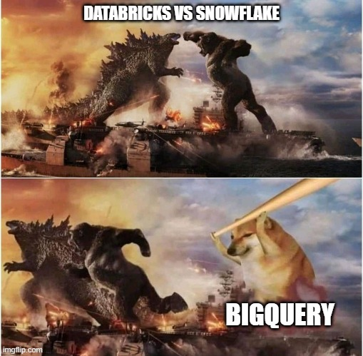
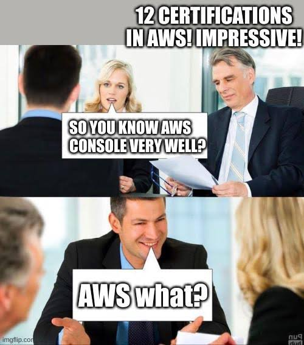
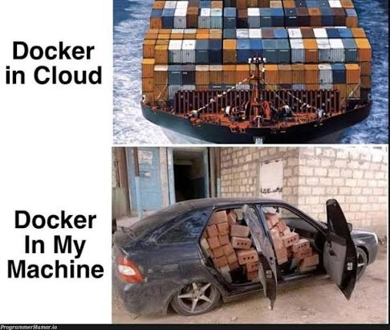
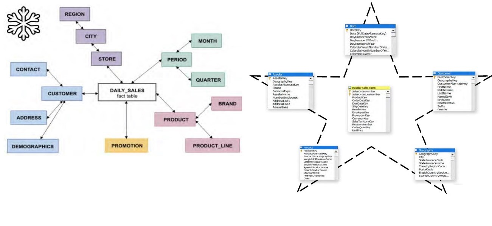

## Objetivo

::: {.highlight-box}
El objetivo de esta práctica es que el alumno aplique los conceptos de modelado dimensional (hechos, dimensiones, granularidad y jerarquías) mediante el diseño e implementación de un Data Warehouse en la plataforma Google BigQuery.
:::

## ¿Qué es Google BigQuery? {.smaller}

::: columns
::: {.column width="55%"}
- Es un data warehouse totalmente gestionado y **serverless** desarrollado por Google para almacenar y analizar datos a gran escala
- Ayuda a administrar y analizar tus datos con funciones integradas como el aprendizaje automático, la búsqueda, el análisis geoespacial y la inteligencia empresarial
- Proporciona una manera uniforme de trabajar con datos estructurados y no estructurados.
:::

::: {.column width="45%"}
{width="100%" fig-align="center" .fragment .fade-up}
:::
:::

## Nube vs. On-premise {.smaller}

::: columns
::: {.column width="55%"}
::: {.fragment .fade-up}
::: {.highlight-box}
**On-premise:** Servidores físicos de la propia empresa. Implica altos costos iniciales, requiere un equipo experto para gestionarlo y una planificación rigurosa para crecer con la demanda, debido a la rigidez al escalar recursos en centros de datos tradicionales.
:::
:::

::: {.fragment .fade-up}
::: {.highlight-box}
**Nube:** gestionada y alojada por un proveedor de servicios cloud, como Google BigQuery, Amazon Redshift o Snowflake.
:::
:::
:::

::: {.column width="45%"}
{width="100%" fig-align="center" .fragment .fade-up}
:::
:::

## On-premise {.smaller}

::: columns
::: {.column width="45%"}
{width="100%" fig-align="center" .fragment .fade-up}
:::

::: {.column width="55%"}
::: {.fragment .fade-up}
*Ventajas*

- Control total sobre hardware y datos
- No depende de conexión a internet
- Cumplimiento normativo más sencillo en sectores muy regulados

*Desventajas*

- Altos costos iniciales (CAPEX)
- Requiere equipo experto para su gestión
- Escalar es lento y rígido
- Todo esta cargo de la empresa
:::
:::
:::

## Nube {.smaller}

::: columns
::: {.column width="70%"}
::: {.fragment .fade-up}
*Ventajas*

- Escala y aprovecha la flexibilidad del entorno cloud
- Mayor velocidad y rendimiento
- Precios flexibles, pago por uso (OPEX) y reduce costos operativos

*Desventajas*

- Dependencia del proveedor (*vendor lock-in*)
- Requiere conexión a internet estable
- Consideraciones de seguridad y soberanía de datos
- Los costos pueden crecer si no se optimiza el uso
:::
:::

::: {.column width="30%"}
{width="100%" fig-align="center" .fragment .fade-up}
:::
:::


## ¿Cómo funciona BigQuery?

- Separa el motor de cómputo del almacenamiento, de modo que cada uno puede escalar por separado
- Resultado: puedes consultar terabytes en segundos y petabytes en minutos

::: {.fragment .custom-fade}
Cuando BigQuery ejecuta una consulta, el motor distribuye el trabajo en paralelo, escanea las tablas relevantes en almacenamiento, combina los resultados y devuelve el conjunto final de datos.
:::

## Funciones clave de BigQuery en 2026 {.smaller}

::: columns
::: {.column width="50%"}
- **BigQuery ML** — Crea, entrena y despliega modelos de machine learning usando SQL
- **Gemini en BigQuery** — Asistencia con IA para escribir consultas, entender esquemas y generar insights en lenguaje natural
- **BigQuery Studio** — Un espacio de trabajo unificado para SQL, notebooks de Python y Spark dentro de la consola de BigQuery
:::

::: {.column width="50%"}
- **Consultas federadas** — Consulta datos en Cloud SQL, Cloud Storage, Bigtable y otras fuentes sin moverlos a BigQuery
- **BigQuery Omni** — Ejecuta analítica de BigQuery sobre datos almacenados en AWS o Azure sin copiarlos a Google Cloud
- **Data Studio** — Permite crear dashboards automatizados que resumen la data
:::
:::

## Base de datos relacional --> Data Warehouse

::: {style="font-size: 0.75em;"}
- Una base de datos relacional (**OLTP**) está normalizada para garantizar integridad y evitar redundancia en transacciones día a día.
- Un **Data Warehouse** (OLAP) busca lo contrario: velocidad de consulta y facilidad de análisis, aunque implique redundancia.

::: {.fragment .fade-up}
Para hacer esta transición existen dos metodologías clásicas de modelado, que difieren en el **orden** en que se construye el warehouse y en el **nivel de normalización** del modelo final: la de **Ralph Kimball** y la de **Bill Inmon**.
:::
:::

## Kimball vs. Inmon {.smaller}

:::: {.columns}

::: {.column width="60%"}
::: {.fragment .fade-up}
**Ralph Kimball — Enfoque "Bottom-Up"**

Se construyen primero **data marts** dimensionales por proceso de negocio, modelados como esquemas estrella o copo de nieve. El Data Warehouse general emerge de la unión de estos data marts mediante un *bus de dimensiones conformadas*.
:::

::: {.fragment .fade-up}
**Bill Inmon — Enfoque "Top-Down"**

Se construye primero un **Data Warehouse corporativo** único que integra los datos de toda la organización. A partir de él se derivan **data marts** departamentales para consumo analítico.
:::
:::

::: {.column width="40%"}
{width="100%" fig-align="center" .fragment .fade-up}
:::

::::

## Kimball vs. Inmon: comparación {.smaller}

::: {.fragment .fade-up}
| Criterio | Kimball | Inmon |
|---|---|---|
| Enfoque | Bottom-Up (de los data marts al DW) | Top-Down (del DW a los data marts) |
| Modelo de datos | Dimensional (estrella / copo de nieve) | Relacional normalizado (3FN) |
| Tiempo de implementación | Más rápido, entregas incrementales | Más lento, requiere visión global primero |
| Redundancia de datos | Mayor (desnormalizado) | Menor (normalizado) |
| Consultas analíticas | Más simples y rápidas | Requieren más `JOIN`s |
| Ideal para | Proyectos ágiles, por departamento | Organizaciones grandes, gobierno de datos estricto |
:::

## ¿Por qué Kimball es la más usada en la industria? {.smaller}

:::: {.columns}

::: {.column width="50%"}
::: {.fragment .fade-up}
Aunque ambas metodologías son válidas, en la práctica **Kimball predomina** sobre Inmon en la mayoría de los proyectos actuales, por razones directamente ligadas a la tabla anterior:
:::
:::

::: {.column width="50%"}
::: {.fragment .fade-up}
- **Entregas incrementales**
- **Menor costo y tiempo inicial**
- **Se adapta mejor a metodologías ágiles**
:::
:::

::::

::: {.fragment .fade-up}
Por estas razones, en esta práctica se utiliza el enfoque de **Kimball**: se modela un único proceso de negocio (ventas) directamente como esquema estrella y copo de nieve, sin necesidad de construir primero un Data Warehouse corporativo normalizado.
:::

## Metodología de Kimball: los 4 pasos {.smaller}

:::: {.columns}

::: {.column width="50%"}
::: {.fragment .fade-up}
**Paso 1 · Seleccionar el proceso de negocio**

Elegir el proceso operativo que se quiere analizar. Suele corresponder a una tabla transaccional central de la base relacional.
:::

::: {.fragment .fade-up}
**Paso 2 · Declarar la granularidad**

Definir qué representa **cada renglón** de la tabla de hechos. Toda decisión posterior depende de este nivel de detalle.
:::
:::

::: {.column width="50%"}
::: {.fragment .fade-up}
**Paso 3 · Identificar las dimensiones**

Detectar el contexto que describe al hecho: quién, qué, cuándo, dónde. Suelen salir de las tablas "maestras" o de catálogo de la base relacional.
:::

::: {.fragment .fade-up}
**Paso 4 · Identificar los hechos**

Detectar las métricas numéricas y aditivas del proceso.
:::
:::

::::

## Del modelo relacional al dimensional{.smaller}

:::: {.columns}

::: {.column width="50%"}
::: {.fragment .fade-up}
1. **Analizar** el modelo entidad-relación fuente y detectar tablas transaccionales (hechos) vs. tablas de catálogo (dimensiones)
2. **Extraer** los datos de la base relacional (proceso *Extract*)
:::
:::

::: {.column width="50%"}
::: {.fragment .fade-up}
3. **Transformar**: desnormalizar, limpiar, generar claves sustitutas (*surrogate keys*) y resolver jerarquías
4. **Cargar** (*Load*) las tablas de hechos y dimensiones ya transformadas en el Data Warehouse (BigQuery)
:::
:::

::::

## ETL vs. ELT {.smaller}

:::: {.columns}

::: {.column width="30%"}
{width="100%" fig-align="center" .fragment .fade-up}
:::

::: {.column width="70%"}
::: {.fragment .fade-up}
**ETL — Extract, Transform, Load**

Los datos se extraen de la fuente, se **transforman en un servidor intermedio** (limpieza, desnormalización, cálculo de métricas, generación de claves sustitutas) y **después** se cargan ya listos en el Data Warehouse.
:::

::: {.fragment .fade-up}
**ELT — Extract, Load, Transform**

Los datos se extraen de la fuente y se **cargan crudos** directamente en el Data Warehouse. La transformación ocurre **después, dentro del propio motor** del warehouse, usando su poder de cómputo (SQL, dbt, BigQuery ML, etc.).
:::
:::

::::

## ETL vs. ELT {.smaller}

::: {.fragment .fade-up style="font-size: 65%;"}
| Criterio | ETL | ELT |
|---|---|---|
| Orden del proceso | Extraer → Transformar → Cargar | Extraer → Cargar → Transformar |
| Dónde se transforma | Servidor/motor intermedio dedicado | Dentro del propio Data Warehouse |
| Velocidad de carga | Más lenta (espera la transformación) | Más rápida (carga datos crudos de inmediato) |
| Escalabilidad de la transformación | Limitada por el servidor ETL | Aprovecha el cómputo elástico de la nube |
| Datos crudos disponibles | No siempre se conservan | Sí, siempre quedan en el warehouse |
| Flexibilidad de análisis | Baja  | Alta  |
| Infraestructura necesaria | Servidor ETL adicional | Solo el Data Warehouse + herramienta de transformación  |
:::

## ¿Por qué hoy se usa más ELT? {.smaller}

:::: {.columns}

::: {.column width="50%"}
::: {.fragment .fade-up}
**1. Cómputo elástico en la nube**
Motores como BigQuery o Snowflake procesan volúmenes masivos en segundos.
:::

::: {.fragment .fade-up}
**2. Almacenamiento ultra barato**
Guardar todo el historial de datos crudos cuesta centavos.
:::
:::

::: {.column width="50%"}
::: {.fragment .fade-up}
**3. Preservación del dato crudo**
Permite re-procesar o auditar la información sin perder nada.
:::

::: {.fragment .fade-up}
**4. Flexibilidad para Big Data**
Soporta datos no estructurados (JSON, logs, eventos) sin esquemas previos.
:::
:::

::::

::: {.fragment .fade-up}
**5. Ecosistema moderno (SQL + dbt)**
Transforma directamente en el warehouse usando solo SQL versionado y modular.
:::

## Esquema final {background-color="#1a0b2e" .center style="text-align: center; color: #ff4d9d;"}

## Algoritmo  Esquema Estrella{.smaller}

:::: {.columns}

::: {.column width="50%"}
::: {.fragment .fade-up}
**1. Crear tabla de hechos (`fact_*`)**
 Define la granularidad del proceso.
 Guarda únicamente métricas numéricas y llaves foráneas.
:::

\

::: {.fragment .fade-up}
**2. Desnormalizar dimensiones (`dim_*`)**
Aplane la información en una sola tabla por contexto (ej. *producto + categoría + departamento*).
:::
:::

::: {.column width="50%"}
::: {.fragment .fade-up}
**Paso 3 · Generar claves sustitutas**
Crea llaves sintéticas (*surrogate keys*) en las dimensiones y vincúlalas a la tabla de hechos.
:::

\

::: {.fragment .fade-up}
**Paso 4 · Un solo nivel de JOIN**
Conecta `fact_*` directamente con cada `dim_*` para lograr consultas simples y ultrarrápidas.
:::
:::

::::

## Algoritmo Esquema Copo de Nieve {.smaller}

:::: {.columns}

::: {.column width="50%"}
::: {.fragment .fade-up}
**Paso 1 · Mantener tabla de hechos (`fact_*`)**
Se conserva el mismo diseño base del esquema estrella.
:::

\

::: {.fragment .fade-up}
**Paso 2 · Normalizar dimensiones**
 Divide en subdimensiones según sus niveles jerárquicos (ej. *producto → categoría → departamento*).
:::
:::

::: {.column width="50%"}
::: {.fragment .fade-up}
**Paso 3 · Enlazar subdimensiones**
Vincula cada nivel con la siguiente subdimensión usando claves sustitutas en cadena.
:::

\

::: {.fragment .fade-up}
**Paso 4 · Resultado final**
 Reduce la redundancia de datos a costa de consultas con más `JOIN`s y mayor complejidad.
:::
:::

::::

## Estrella vs. Copo de Nieve: ¿cuál elegir? {.smaller}

::: {.fragment .fade-up}
| Criterio | Estrella | Copo de Nieve |
|---|---|---|
| Normalización de dimensiones | Ninguna (desnormalizado) | Parcial/total (normalizado) |
| Complejidad de las consultas | Baja (pocos `JOIN`s) | Mayor (`JOIN`s encadenados) |
| Rendimiento de lectura | Generalmente más rápido | Puede ser más lento |
| Espacio en disco | Mayor (redundancia) | Menor (sin redundancia) |
| Mantenimiento de jerarquías | Más difícil | Más fácil |
:::

## Esquemas 

{width="100%" fig-align="center"}

# Desarrollo

Para esta práctica se ha seleccionado el dataset público `bigquery-public-data.thelook_ecommerce`.

Se debe de modelar de forma natural un proceso de negocio transaccional, a partir del cual se pueden derivar tanto la tabla de hechos como sus dimensiones.

## Paso 1: Preparación del entorno de trabajo{.smaller}

1. Ingresar a la consola de BigQuery: [console.cloud.google.com/bigquery](https://console.cloud.google.com/bigquery) y seleccionar (o crear) un proyecto de GCP.
2. En el panel *Explorer*, hacer clic en el ícono *Add* → *Public Datasets*, dar clic en "Destacados por nombre", escribir *bigquery-public-data* y fijarlo al proyecto para poder explorarlo desde el árbol de navegación. Todo debe estar en la misma región, que sería **US**, ya que si no se encuentran en la misma región no se van a encontrar los recursos.
3. Crear dos *datasets* propios donde se construirá el Data Warehouse, mediante el botón de los tres puntos junto al nombre del proyecto → *Create dataset* → como nombre de los datasets `dw_estrella` y `dw_copo_nieve`.

## Paso 1: Script de creación

```sql
CREATE SCHEMA IF NOT EXISTS `id_proyecto.dw_estrella`
  OPTIONS (location = 'US');

CREATE SCHEMA IF NOT EXISTS `id_proyecto.dw_copo_nieve`
  OPTIONS (location = 'US');
```

::: {.fragment .fade-up}
*(Sustituir `id_proyecto` por el ID real del proyecto de GCP del alumno.)*
:::

## Paso 2.1: Exploración de la fuente de datos

Entender la estructura de las tablas fuente y definir cuál será el hecho de negocio, su granularidad y sus métricas.

```sql
SELECT * FROM `bigquery-public-data.thelook_ecommerce.order_items` LIMIT 10;
SELECT * FROM `bigquery-public-data.thelook_ecommerce.products`    LIMIT 10;
SELECT * FROM `bigquery-public-data.thelook_ecommerce.users`       LIMIT 10;
```

## Paso 2.2: Definición del hecho de negocio{.smaller}

::: {.fragment .fade-up}
| Elemento | Definición |
|---|---|
| **Granularidad** | Un renglón por cada producto vendido dentro de un pedido (`order_items.id`) |
| **Métricas (hechos)** | `sale_price` (precio de venta), `cost` (costo del producto), `ganancia` (precio − costo) |
| **Dimensiones** | Cliente, Producto, Tiempo, Centro de Distribución |
:::

## Paso 3: Diseño del modelo dimensional{.smaller}

**Qué se debe hacer:** dibujar el diagrama conceptual de cada esquema antes de programarlos.

- **Esquema Estrella:** una tabla central `fact_ventas` rodeada de `dim_cliente`, `dim_producto`, `dim_tiempo` y `dim_centro_distribucion`, todas desnormalizadas (un solo nivel)
- **Esquema Copo de Nieve:** la misma tabla `fact_ventas`, pero con `dim_producto` descompuesta en `dim_categoria` y `dim_departamento`, y `dim_cliente` descompuesta en `dim_ciudad`, `dim_estado` y `dim_pais`

## Paso 4: Consultas Analíticas y Operaciones OLAP

Se deben ejecutar las siguientes consultas:

1. **ROLL-UP:** ventas totales por mes y categoría
2. **DRILL-DOWN:** de mes a día para una categoría específica
3. **SLICE:** ventas únicamente del país "México"
4. **DICE:** ventas de las categorías "Jeans" y "Sweaters", en "México" y "Brasil"

## Paso 4: Esquema Copo de Nieve — consideraciones

::: {.fragment .fade-up}
Para las consultas sobre el esquema `dw_copo_nieve` se requerirá encadenar `JOIN`s adicionales, por ejemplo:
:::

::: {.fragment .fade-up}
- `dim_producto` → `dim_categoria` para obtener el nombre de la categoría
- `dim_cliente` → `dim_ciudad` → `dim_estado` → `dim_pais` para obtener el país
:::

## Interfaz de Google Query {background-color="#1a0b2e" .center style="text-align: center; color: #ff4d9d;"}

## Referencias

- [Introducción a BigQuery — Google Cloud](https://cloud.google.com/bigquery/docs/introduction?hl=es-419)
- [BigQuery para principiantes — DataCamp](https://www.datacamp.com/es/tutorial/beginners-guide-to-bigquery)
- [Calculadora de precios — Google Cloud](https://cloud.google.com/products/calculator?hl=es)
- [Guía práctica de diseño y arquitectura de data warehouse](https://www.databricks.com/es/blog/data-warehouse-design)
- [¿Cuál es la diferencia entre los procesos de ETL y ELT?](https://aws.amazon.com/es/compare/the-difference-between-etl-and-elt/)