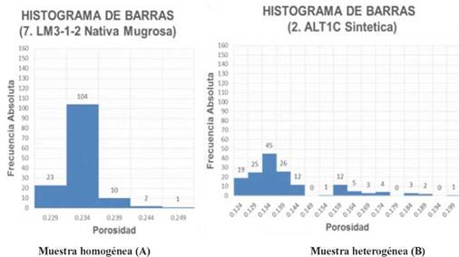

```{python}
#| include: false
# Configuración inicial: se ejecuta una sola vez y queda disponible
# (np, plt) para todos los chunks de código del resto de la presentación.
import numpy as np
import matplotlib.pyplot as plt
```

## Objetivo de la práctica

- Calcular e interpretar medidas de **localización**, **variabilidad**, **heterogeneidad** y **concentración**
- Calcular específicamente el **coeficiente de Gini** y la **entropía de Shannon**
- Comunicar los hallazgos con visualizaciones adecuadas
- Reflexionar críticamente sobre qué revelan —y qué ocultan— estas medidas sobre la violencia contra las mujeres

## ¿Por qué esta práctica? {.smaller}

En la Práctica 3 se dejaron los datos **limpios, sin duplicados, con tipos correctos** en `data/data-processed/`.

El siguiente paso natural en minería de datos es **describir cuantitativamente** esos datos antes de modelar: es el rol de la **estadística descriptiva** dentro del Análisis Exploratorio de Datos (EDA).

::: {.highlight-box}
No se vuelve a descargar ni reestructurar el proyecto: se **extiende** la arquitectura ya existente.
:::

## Dos preguntas, dos familias de medidas

::: {.fragment .fade-up}
**Concentración** — *¿qué proporción del total se acumula en una fracción pequeña de las unidades de análisis?*
Herramienta clásica: curva de Lorenz y coeficiente de Gini.
:::

::: {.fragment .fade-up}
**Heterogeneidad** — *¿qué tan mezcladas o diversas son las categorías?*
Herramientas: IQV, Gini-Simpson, entropía de Shannon.
:::

::: {.fragment .fade-up}
Uno mide desigualdad en cómo se reparte una cantidad; el otro mide diversidad entre categorías.
:::

## Nota de sensibilidad del tema

::: {.callout-note}
El análisis debe hacerse con **rigor técnico y responsabilidad ética**:

- Evitar conclusiones que estigmaticen personas, grupos o entidades federativas
- Recordar que los datos representan **experiencias reales** de violencia
- Una concentración alta en una entidad **no implica automáticamente** "ahí hay más violencia" — puede reflejar diferencias en denuncia, tamaño poblacional o factores de expansión
:::

# Medidas de Localización y Variabilidad

## ¿Qué miden? {.smaller}

::: {.columns}
::: {.column width="45%"}
**Localización** — dónde se "centra" la distribución

- Media, mediana, moda
- Percentiles / cuantiles
- Media ponderada por factor de expansión
:::

::: {.column width="10%"}
:::

::: {.column width="45%"}
**Variabilidad** — qué tan dispersos están los datos

- Varianza y desviación estándar
- Coeficiente de variación (CV)
- Rango intercuartílico (IQR)
:::
:::

# Medidas de Heterogeneidad

## ¿Qué miden realmente? {.smaller}

Mientras que la varianza evalúa dispersión numérica, estas medidas aplican a **variables cualitativas** (categóricas).

Responden a una pregunta central:

> *¿Los datos se aglutinan en una sola categoría dominante (baja heterogeneidad) o están repartidos de forma equilibrada entre todas las opciones (alta heterogeneidad)?*

::: {.fragment}
**Los cimientos matemáticos:**
Para calcular qué tan mezclados están los datos, las fórmulas utilizan dos bloques básicos:

- $k$ = El **número total de categorías** posibles.
  *(Ej. Si analizamos el "Tipo de violencia", tenemos Psicológica, Física, Económica y Sexual, por lo tanto $k = 4$)*.
- $p_i$ = La **proporción** de casos que caen en la categoría $i$.
  *(Ej. Si el 50% de los reportes son de violencia psicológica, su $p_i = 0.5$)*.
:::

---

{width="60%" fig-align="center"}

## Índice de Variación Cualitativa (IQV)

$$\text{IQV} = \frac{k\left(1 - \sum_{i=1}^{k} p_i^2\right)}{k - 1}$$

- $\text{IQV} = 0$ → toda la masa en una sola categoría (heterogeneidad nula)
- $\text{IQV} = 1$ → categorías perfectamente balanceadas (heterogeneidad máxima)

## Índice de Gini-Simpson

$$\text{GS} = 1 - \sum_{i=1}^{k} p_i^2$$

- Interpretación intuitiva: probabilidad de que **dos observaciones elegidas al azar** pertenezcan a categorías **distintas**
- Mismo rango de comportamiento que el IQV, pero sin reescalar por $k$

## Entropía de Shannon

$$H = -\sum_{i=1}^{k} p_i \log_2(p_i), \qquad 0 \le H \le \log_2(k)$$

- Mide **incertidumbre**: ¿qué tan difícil es predecir la categoría de un caso elegido al azar?
- $H = 0$ → nula incertidumbre (una sola categoría)
- $H = \log_2(k)$ → máxima incertidumbre (categorías balanceadas)

## ¿Cuándo usar cada una? {.smaller}

::: {.fragment .fade-up}
**Usa Entropía / Gini-Simpson / IQV cuando...**
La pregunta es *¿qué tan mezcladas o diversas son las categorías?*
Ejemplo: tipo de violencia, modalidad, relación con el agresor
:::

::: {.fragment .fade-up}
**Usa el coeficiente de Gini / curva de Lorenz cuando...**
La pregunta es *¿qué proporción del total se concentra en pocas unidades?*
Ejemplo: casos de violencia por entidad federativa
:::

:::: {.fragment}
::: {.callout-note}
Si aplicas ambas a la **misma** variable categórica (cada categoría como "unidad", su frecuencia como la "cantidad" a repartir), obtienes dos lecturas complementarias: la entropía dice qué tan mezclada está; el Gini sobre esas mismas frecuencias dice qué tan desigual es esa mezcla.
:::
::::

## Caso Práctico {.smaller}

Imaginemos que analizamos un subconjunto de **100 casos reportados de violencia**.
¿Están concentrados en un solo tipo o vemos una mezcla de todas las formas de violencia?

```{python}
categorias = ["Psicológica", "Física", "Económica", "Sexual"]
frecuencias = np.array([50, 30, 15, 5])
k = len(categorias)

for cat, f in zip(categorias, frecuencias):
    print(f"- {cat:12s}: {f} casos")
```

::: {.callout-note title="Observación inicial"}
A simple vista notamos que la violencia "Psicológica" acapara la mitad de los casos (50), mientras que la "Sexual" es la minoría (5). Esto ya nos indica que **no hay un balance perfecto**.
:::

## Paso 1: Las proporciones {.smaller}

Todas las fórmulas de heterogeneidad necesitan convertir frecuencias absolutas a proporciones ($p_i$) y, fundamentalmente, **elevar esas proporciones al cuadrado ($p_i^2$)**.

*¿Por qué al cuadrado?* Porque penaliza fuertemente a las categorías minoritarias y recompensa a las mayoritarias, revelando qué tan dominante es el pico de la distribución.

```{python}
p = frecuencias / frecuencias.sum()
print(f"Proporciones (p_i): {np.round(p, 3)}")
print(f"Proporciones al cuadrado (p_i^2): {np.round(p**2, 4)}")

suma_cuadrados = np.sum(p**2)
print(f"\nSuma de p_i^2 = {round(suma_cuadrados, 4)}")
```

::: {.fragment}
▶ Si todos los casos estuvieran en "Psicológica", la suma sería **1**.\
▶ Si hubiera 25 casos de cada tipo, la suma sería **0.25** (lo mínimo posible).\
▶ Nuestro **0.365** está en un punto intermedio.
:::

## Paso 2: Índices de Gini-Simpson e IQV {.smaller}

**Gini-Simpson ($1 - \sum p_i^2$)**
Mide la probabilidad de que, al tomar 2 reportes al azar, sean de tipos de violencia *distintos*.

```{python}
GS = 1 - suma_cuadrados
print(f"Gini-Simpson = {GS:.4f}")
```

*(Hay un 63.5% de probabilidad de que dos víctimas al azar hayan sufrido distintos tipos de violencia).*

::: {.fragment}
**Índice de Variación Cualitativa (IQV)**
Ajusta el valor anterior usando el número de categorías ($k=4$) para darnos una métrica de **0 a 1** (donde 1 es la máxima mezcla posible).

```{python}
IQV = (k * GS) / (k - 1)
print(f"IQV = {IQV:.4f}")
```

*(Nuestros datos alcanzan casi el 85% de la máxima diversidad posible).*
:::

::: {.fragment}
Fíjate que **IQV es simplemente Gini-Simpson reescalado**: $\text{IQV} = \frac{k}{k-1}\,\text{GS}$.
:::

## Paso 3: Entropía de Shannon {.smaller}

*Si te digo el tipo de violencia de un caso elegido al azar, ¿qué tan "sorprendido" te vas a llevar?*

- Un evento **casi seguro** (p cercana a 1) no sorprende casi nada → aporta **poca** información
- Un evento **raro** (p cercana a 0) sí sorprende → aporta **mucha** información
- Shannon mide esa sorpresa en **bits**, con la fórmula $-\log_2(p_i)$

::: {.fragment}
Pero la sorpresa de una sola categoría no basta: necesitamos **un solo número** que resuma a las 4 categorías juntas. Para eso, Shannon promedia la sorpresa de cada categoría, **ponderándola por qué tan seguido ocurre**.
:::

## Paso 3a: la "ocurrencia" de cada categoría {.smaller}

Primero calculamos $-\log_2(p_i)$ para cada categoría: entre menos frecuente es un tipo de violencia, más bits de sorpresa aporta si aparece.

```{python}
sorpresa = -np.log2(p)

for cat, pi, s in zip(categorias, p, sorpresa):
    print(f"{cat:12s}  p_i={pi:.2f}   -log2(p_i) = {s:.4f} bits")
```

::: {.fragment}
"Sexual" (5% de los casos) sorprende casi **4.3 bits** si aparece; "Psicológica" (50% de los casos) apenas sorprende **1 bit**, porque ya la esperábamos.
:::

## Paso 3b: ponderando la sorpresa por su probabilidad {.smaller}

Ahora multiplicamos la sorpresa de cada categoría por $p_i$: así las categorías raras (mucha sorpresa, pero ocurren poco) no dominan el resultado, y las comunes (poca sorpresa, pero ocurren mucho) sí pesan.

```{python}
contribucion = p * sorpresa

for cat, c in zip(categorias, contribucion):
    print(f"{cat:12s}  p_i * (-log2 p_i) = {c:.4f}")

H = contribucion.sum()
print(f"\nSuma de todas las contribuciones -> H = {H:.4f} bits")
```

::: {.fragment}
$H$ es literalmente la **suma de esas 4 contribuciones**: no es una fórmula misteriosa, es un promedio ponderado de "qué tan sorprendente es cada categoría".
:::

## Paso 3c: comparando contra el máximo posible {.smaller}

```{python}
H_max = np.log2(k)  # bits si las 4 categorías fueran igual de probables

print(f"Entropía (H)     = {H:.4f} bits")
print(f"Entropía Máxima  = {H_max:.4f} bits")
print(f"\nH / H_max = {H/H_max:.4f} ({H/H_max*100:.1f}%)")
```

$H_{max} = \log_2(k)$ es la entropía que tendríamos si las 4 categorías fueran **igual de probables** (25% cada una): ahí ninguna te da pistas de antemano, así que la sorpresa promedio es máxima.

La entropía relativa ($H/H_{max}$) nos dice que tenemos el **82.4%** de la incertidumbre que tendríamos en ese escenario perfectamente balanceado.

## Visualizando la distribución {.smaller}

```{python}
#| fig-align: center
fig, ax = plt.subplots(figsize=(7, 4))
colores = ["#9d4edd", "#3a86ff", "#48cae4", "#ff4d9d"]
ax.bar(categorias, p, color=colores)
ax.set_ylabel("Proporción de casos (p_i)")
ax.set_title("Distribución de tipos de violencia reportados")
ax.set_ylim(0, 1)
for i, val in enumerate(p):
    ax.text(i, val + 0.02, f"{val:.0%}", ha="center")
plt.show()
```

La barra de "Psicológica" domina visualmente el resto — la misma historia que cuentan GS=0.635, IQV=0.847 y H/H_max=0.824, pero ahora se puede ver de un vistazo.

## Síntesis del ejemplo {.smaller}

| Índice | Valor | ¿Qué significa en la realidad? |
| --- | --- | --- |
| **Gini-Simpson** | 0.635 | Probabilidad moderada-alta de cruzar víctimas con vivencias diferentes. |
| **IQV** | 0.847 | La distribución está al 85% de ser perfectamente heterogénea. |
| **Entropía (Relativa)** | 0.824 | Tenemos un 82% de incertidumbre al predecir el tipo de violencia del siguiente caso. |

# Gini vs. Entropía

## Primos conceptuales, no sinónimos {.smaller}

| | **Entropía de Shannon** (heterogeneidad) | **Gini** (concentración) |
|---|---|---|
| Mide | Diversidad / incertidumbre entre categorías | Desigualdad en cómo se reparte una cantidad |
| Rango | $0$ a $\log_2(k)$ | $0$ a $1$ |
| Pregunta | ¿Qué tan mezcladas están las categorías? | ¿Qué proporción se concentra en pocas unidades? |
| Origen | Teoría de la información (1948) | Estadística económica (1912) |

# Medidas de Concentración

## ¿Qué miden? — Curva de Lorenz {.smaller}

Responde: *¿qué fracción de una cantidad total (casos de violencia) se acumula en una fracción pequeña de las unidades (entidades federativas)?*

Construcción de la curva:

1. Ordenar las unidades de **menor a mayor** en la cantidad de interés
2. Calcular la proporción **acumulada** de la cantidad
3. Calcular la proporción **acumulada** de unidades
4. Graficar (prop. acumulada de unidades, prop. acumulada de la cantidad) contra la **diagonal de igualdad perfecta**

Misma herramienta que usa la economía para medir desigualdad del ingreso.

## Coeficiente de Gini

$$G = \frac{2\sum_{i=1}^{n} i\, x_{(i)} - (n+1)\sum_{i=1}^{n} x_{(i)}}{n\sum_{i=1}^{n} x_{(i)}}, \quad x_{(i)} \text{ ordenado ascendentemente}$$

- $G = 0$ → reparto perfectamente homogéneo entre entidades
- $G \to 1$ → casi todos los casos concentrados en muy pocas entidades

## Ejemplo Paso 1: los datos

Casos reportados (hipotéticos) en 5 entidades, ya ordenados de menor a mayor:

```{python}
entidades = ["E", "D", "C", "B", "A"]
casos = np.array([5, 10, 15, 30, 40])
total = casos.sum()
n = len(casos)

for e, c in zip(entidades, casos):
    print(f"Entidad {e}: {c} casos")
print("Total:", total)
```

## Ejemplo Paso 2: proporciones acumuladas

Vamos entidad por entidad, **sumando** los casos como si fueran llegando en fila. En cada paso preguntamos: *¿cuántos casos llevamos acumulados hasta aquí?*

```{python}
acumulado = 0
print(f"{'Entidad':10s}{'Casos':>8s}{'Acumulado':>12s}{'Prop. acum.':>14s}")

for e, c in zip(entidades, casos):
    acumulado += c
    print(f"{e:10s}{c:8d}{acumulado:12d}{acumulado/total:14.2f}")

# Proporciones acumuladas (se reutilizan en la curva de Lorenz)
cum_casos = np.cumsum(casos) / total
cum_entidades = np.arange(1, n + 1) / n
```

::: {.fragment}
Al llegar a la última entidad, el acumulado siempre coincide con el **total** (100). Eso es justo lo que confirma que no se nos perdió ningún caso en el camino.
:::

## Ejemplo Paso 3: coeficiente de Gini

```{python}
i = np.arange(1, n + 1)

numerador = 2 * np.sum(i * casos) - (n + 1) * total
denominador = n * total
gini = numerador / denominador

print(f"Numerador   = {numerador}")
print(f"Denominador = {denominador}")
print(f"Coeficiente de Gini = {gini:.3f}")
```

## Ejemplo Paso 3a: ¿de dónde sale el numerador? {.smaller}

$$\text{Numerador} = 2\sum_{i=1}^{n} i\,x_{(i)} - (n+1)\sum_{i=1}^{n} x_{(i)}$$

Cada entidad se multiplica por su **posición** en el orden (1 = la que menos casos tiene, 5 = la que más): así, las entidades con más casos pesan más.

```{python}
posicion = np.arange(1, n + 1)  # 1 = entidad con menos casos, n = la que más tiene
producto = posicion * casos

for e, pos, c, prod in zip(entidades, posicion, casos, producto):
    print(f"Entidad {e}: posición {pos} x {c:2d} casos = {prod}")

suma_ix = producto.sum()
referencia = (n + 1) * total

print(f"\nSuma de i*x         = {suma_ix}")
print(f"2 x suma de i*x     = {2 * suma_ix}")
print(f"(n+1) x total       = {referencia}")
print(f"Numerador           = {2 * suma_ix} - {referencia} = {2 * suma_ix - referencia}")

# Contraste: ¿qué pasaría con un reparto perfectamente igualitario?
igualdad = np.full(n, total / n)  # 20 casos por entidad
print(f"\nSi todas tuvieran {total // n} casos: numerador = {2 * np.sum(posicion * igualdad) - referencia:.0f}")
```

## Ejemplo Paso 3b: ¿qué representan 180 y 500? {.smaller}

**Numerador (180)** = suma de las diferencias absolutas entre **todos los pares** de entidades. Mide qué tan *distintas* son las entidades entre sí.

```{python}
diferencias = [abs(a - b) for idx, a in enumerate(casos) for b in casos[idx + 1:]]

print(f"Pares de entidades: {len(diferencias)}")
print(f"Suma de |x_i - x_j| sobre todos los pares = {sum(diferencias)}")
```

::: {.fragment}
**Denominador (500)** = $n \times \text{total} = 5 \times 100$. Es un factor de escala (equivale a $n^2 \times \text{media} = 25 \times 20$): sin él, el 180 crecería solo por agregar entidades o casos y no podríamos comparar problemas distintos.
:::

::: {.fragment}
**Conexión con la curva de Lorenz:** $G = \dfrac{180}{500}$ es lo mismo que el área entre la diagonal y la curva, dividida entre el área total bajo la diagonal (0.5).

```{python}
xl = np.concatenate([[0], cum_entidades])
yl = np.concatenate([[0], cum_casos])

area_bajo_lorenz = np.sum((yl[1:] + yl[:-1]) / 2 * np.diff(xl))
area_entre = 0.5 - area_bajo_lorenz

print(f"Área bajo la curva de Lorenz      = {area_bajo_lorenz:.2f}")
print(f"Área entre la diagonal y la curva = {area_entre:.2f}")
print(f"Gini = área entre / 0.5           = {area_entre / 0.5:.2f}")
```
:::

## Ejemplo Paso 4: graficar la curva de Lorenz

```{python}
#| fig-align: center
x = np.concatenate([[0], cum_entidades])
y = np.concatenate([[0], cum_casos])

fig, ax = plt.subplots(figsize=(6, 6))
ax.plot(x, y, marker="o", label="Curva de Lorenz")
ax.plot([0, 1], [0, 1], linestyle="--", label="Igualdad perfecta")
ax.fill_between(x, y, x, alpha=0.2)
ax.set_xlabel("Proporción acumulada de entidades")
ax.set_ylabel("Proporción acumulada de casos")
ax.set_title(f"Curva de Lorenz (Gini = {gini:.2f})")
ax.legend()
plt.show()
```

## Interpretación: G = 0.36

- El área entre la curva de Lorenz y la diagonal de igualdad es **moderada**
- Existe **concentración por encima de lo homogéneo**, pero lejos del extremo ($G\to1$)
- En el contexto de ENDIREH: sugiere que algunas entidades concentran más casos que otras, **sin** que unas pocas acaparen prácticamente todo

# Desarrollo de la Práctica sobre ENDIREH 2021

## Punto de partida: lo que ya tenemos de la Práctica 3

- Estructura de carpetas del proyecto
- `README.md` y `requirements.txt`
- `data/data-processed/endireh_2021_limpio.csv` — **ya limpio**, sin duplicados, tipos correctos, sin faltantes

::: {.callout-note}
No se descarga ni reestructura de nuevo: se **extiende** el proyecto existente.
:::

##  Notebook: Medidas de Heterogeneidad

Sobre variables cualitativas, calcular:

- Índice de Variación Cualitativa (IQV)
- Índice de Gini-Simpson
- Entropía de Shannon

Con gráficos e **interpretación** en el contexto de violencia contra las mujeres.

## Notebook: Medidas de Concentración

- Analizar los casos reportados **ponderados por el factor de expansión**
- Construir la **curva de Lorenz** por entidad federativa
- Calcular el **coeficiente de Gini**
- Interpretar: ¿concentración territorial alta o reparto homogéneo?

##  Síntesis Gini y Entropía

- Elegir **una misma variable categórica** (p. ej. tipo de violencia)
- Calcular sobre ella tanto la entropía de Shannon como una versión del Gini aplicada a las frecuencias de sus categorías
- Redactar, en **no más de un párrafo**, la diferencia conceptual entre ambas lecturas

##  Tabla de resultados

| Familia de medida | Variable(s) | Valor obtenido | Interpretación |
|---|---|---|---|
| Localización | | | |
| Variabilidad | | | |
| Heterogeneidad | | | |
| Concentración | | | |
| Gini vs. Entropía | | | |

## Qué se busca en cada criterio {.smaller}

- **Localización**: media, mediana, moda y cuantiles — con **media ponderada justificada** por factor de expansión
- **Variabilidad**: varianza, SD, CV, IQR — con **comparación entre grupos**
- **Heterogeneidad / Concentración**: cálculo correcto + **interpretación adecuada**
- **Síntesis**: comparación explícita y **bien argumentada**
- **Visualización**: claridad, pertinencia e **integración narrativa** en el notebook
- **Reflexión**: profundidad, limitaciones detectadas y **sensibilidad** ante el tema social

# Formato de Entrega

## Reporte PDF

Resumen ejecutivo y conciso que incluya:

- La **tabla de resultados** completa
- Las **gráficas**: histograma/boxplot, barras de heterogeneidad, curva de Lorenz, prevalencia por entidad — cada una con su interpretación
- Las **respuestas al cuestionario**

## Repositorio de Git actualizado

- Medidas de localización
- Medidas de variabilidad
- Medidas de heterogeneidad
- Medidas de concentración
- Comparación de Gini y Entropía

Más `README.md` y `requirements.txt` **actualizados**.

## Recapitulación

- **Heterogeneidad** (IQV, Gini-Simpson, Entropía) mide qué tan mezcladas están las categorías
- **Concentración** (Lorenz, Gini) mide qué tan desigual es el reparto de una cantidad

# ¡Gracias! 

## Referencias clave

- INEGI (2022). *Encuesta Nacional sobre la Dinámica de las Relaciones en los Hogares (ENDIREH) 2021*
- Gini, C. (1912). *Variabilità e mutabilità*
- Shannon, C. E. (1948). *A Mathematical Theory of Communication*
- Wilcox, A. R. (1973). *Indices of Qualitative Variation and Political Measurement*


